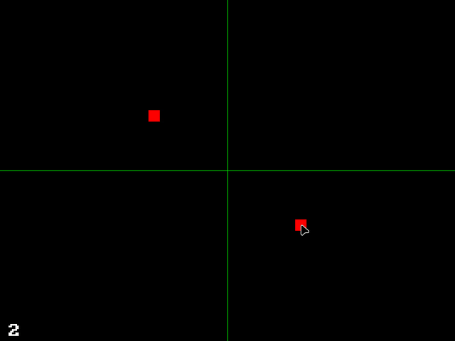
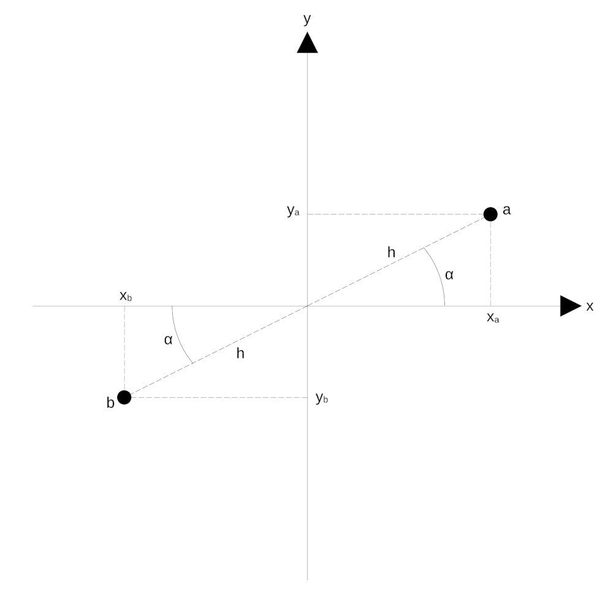
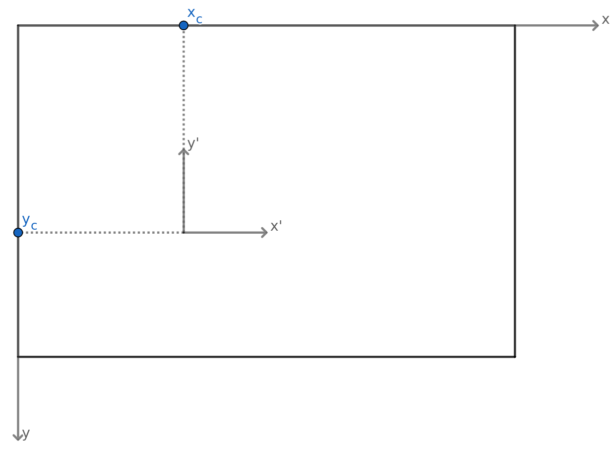

# Rotational symmetry

Applying rotational symmetry to a point on the screen.

Controls:
- Mouse moves the main point.
- Number keys set the order of symmetry.
- Arrow keys move the center of symmetry.

## Rotational symmetry calculation

Given the coordinates of a point of the displayed window, and an order of rotational symmetry, how to find the coordinates of all symmetrical points? In the following, we will see a simple example of this operation with a coordinate system usual for geometry, then a generalization of this example, and finally how to apply the resulting formulas to a computer graphics coordinate system such as that of SDL.

### Example: Order of symmetry 2

Let's start with a simple example in a coordinate system $(x', y')$ where the order of symmetry $s = 2$. We have a point $a$ of coordinates $(x'_a, y'_a)$ and its symmetrical $b$ of coordinates $(x'_b, y'_b)$, with respect to rotation about the origin. Let's call $h$ the distance between the origin and the points $a$. It's the same distance between the origin and point $b$.

Given the original point $a$, we want to find its symmetrical $b$. In other words, we want to express $(x'_b, y'_b)$ as a function of $(x'_a, y'_a)$.

We have

$\cos(\alpha) = x'_a/h \implies h = x'_a/\cos(\alpha)$

$\sin(\alpha) = y'_a/h \implies h = y'_a/\sin(\alpha)$

and

$\cos(\alpha + \pi) = x'_b/h \implies x'_b = h\cos(\alpha + \pi)$

$\sin(\alpha + \pi) = y'_b/h \implies y'_b = h\sin(\alpha + \pi)$

so

$x'_b = x'_a \frac{\cos(\alpha+\pi)}{\cos(\alpha)}$

$y'_b = y'_a \frac{\sin(\alpha+\pi)}{\sin(\alpha)}$

but we know that

$\cos(a+b) = \cos(a)\cos(b) - \sin(a)\sin(b)$

$\sin(a + b) = \sin(a)\cos(b) + \cos(a)\sin(b)$

which means that

$x'_b = x'_a \frac{\cos(\alpha)\cos(\pi) - \sin(\alpha)\sin(\pi)}{\cos(\alpha)} = x'_a(\cos(\pi) - \frac{y'_a}{x'_a}\sin(\pi)) = x'_a\cos(\pi) - y'_a\sin(\pi)$

$y'_b = y'_a \frac{\sin(\alpha)\cos(\pi) + \cos(\alpha)\sin(\pi)}{\sin(\alpha)} = y'_a(\cos(\pi) + \frac{x'_a}{y'_a}\sin(\pi)) = y'_a\cos(\pi) + x'_a\sin(\pi)$.

This ends up giving $x'_b = -x'_a$ and $y'_b = -y'_a$, as expected. 

### Generalization

In the above example, the angle between the $x'$ axis and the line between the origin and the point $a$ is noted as $\alpha$, which is equivalent to $\alpha + \beta_0$ where $\beta_0 = 0$. Once the point $a$ is rotated by an order $s = 2$ around the origin, the resulting angle is $\alpha + \pi$, or $\alpha + \beta_1$ where $\beta_1 = \pi$.

If we apply the same principle to an order of symmetry $s = 3$, we get three angles: $\alpha = \alpha + \beta_0$ where $\beta_0 = 0$, $\alpha + 2\pi/3 = \alpha + \beta_1$ where $\beta_1 = 2\pi/3$, and $\alpha + 4\pi/3 = \alpha + \beta_2$ where $\beta_2 = 4\pi/3$.

We can generalize this by naming those angles $\beta_n$ such that:

$\beta_n = \frac{2\pi n}{s}$ where $n = (0, 1, ..., s-1)$.

With this definition of $\beta_n$, we can find the coordinates of all symmetrical rotations $(x'_n, y'_n)$ of a point of coordinates $(x'_0, y'_0)$:

$x'_n = x'_0\cos(\beta_n) - y'_0\sin(\beta_n)$

$y'_n = y'_0\cos(\beta_n) + x'_0\sin(\beta_n)$.

### Translation to a graphic window

The formulas above work in a coordinate system where the center of symmetry is at coordinates $(0, 0)$. In a coordinate system such as that of an SDL window, coordinates $(0,0)$ correspond to the top-left corner, which might not be where we want the center of symmetry. How to modify those formulas so that they are valid with any center of symmetry within a window?

Let's call $(x, y)$ the coordinates of the system we want to use now (i.e. the window), and $(x_c, y_c)$ the coordinates of the center of symmetry in this system. We can translate window coordinates to geometric coordinates with the following relations:

$x' = x - x_c$

$y' = -y + y_c$.

Which means that to find the geometric coordinates of symmetrical points $(x_n', y_n')$ based on the window coordinates of a point $(x_0, y_0)$, we use the formulas:

$x_n' = x_0'\cos(\beta_n) - y_0'\sin(\beta_n) = (x_0 - x_c)\cos(\beta_n) - (-y_0 + y_c)\sin(\beta_n)$

$y_n' = y_0'\cos(\beta_n) + x_0'\sin(\beta_n) = (-y_0 + y_c) \cos(\beta_n) + (x_0 - x_c)\sin(\beta_n)$.

To translate these coordinates again in the window system, we use the relations

$x = x' + x_c$

$y = -y' + y_c$

in order to get

---

$x_n = (x_0 - x_c)\cos(\beta_n) + (y_0 - y_c)\sin(\beta_n) + x_c$

$y_n = (y_0 - y_c) \cos(\beta_n) - (x_0 - x_c)\sin(\beta_n) + y_c $

with $\beta_n = \frac{2\pi n}{s}$ where $n = (0, 1, ..., s-1)$.

---

The above formulas let us compute the graphic window coordinates of all points rotationally symmetrical with an order $s$ to a point $(x_0, y_0)$ around a center of symmetry $(x_c, y_c)$.